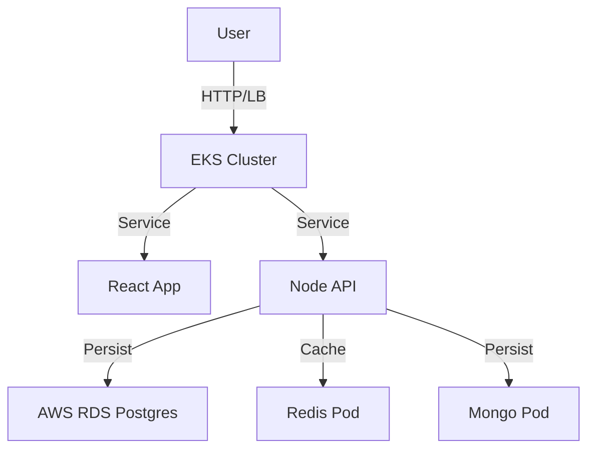

# DevOps Project Report

## 1. Technologies Used
- **Containerization**: Docker, Docker Compose (Multistage builds).
- **IaC**: Terraform (AWS VPC, EKS, RDS).
- **Configuration**: Ansible (Environment setup).
- **Orchestration**: Kubernetes (Deployments, Services, Secrets).
- **CI/CD**: GitHub Actions (Build, Push, Deploy).
- **Monitoring**: Prometheus (Metrics), Grafana (Visualization).

## 2. Infrastructure & Pipeline Architecture
### Architecture

### CI/CD Pipeline
1.  **Source**: GitHub Push.
2.  **Build**: Node.js Install, Lint, Build.
3.  **Image**: Docker Build -> Push to ECR.
4.  **Infra**: Terraform Plan.
5.  **Deploy**: `kubectl apply` to update cluster.

## 3. Secret Management Strategy
- **Local**: `.env` file (gitignored).
- **Kubernetes**: `Secret` objects (base64 encoded), injected as Environment Variables.
- **CI/CD**: GitHub Repository Secrets (`AWS_ACCESS_KEY_ID`, etc.).

## 4. Monitoring Strategy
- **Prometheus**: Scrapes metrics from nodes and pods.
- **Grafana**: Visualizes CPU, Memory, and application health.
- **Alerting**: (Future) Configure Alertmanager for high error rates.

## 5. Lessons Learned
- **State Management**: Terraform state requires locking (S3/DynamoDB) for team usage.
- **Complexity**: EKS setup is complex; managing VPCs and Subnets requires careful planning.
- **Automation**: CI/CD saves significant time in deployments.
