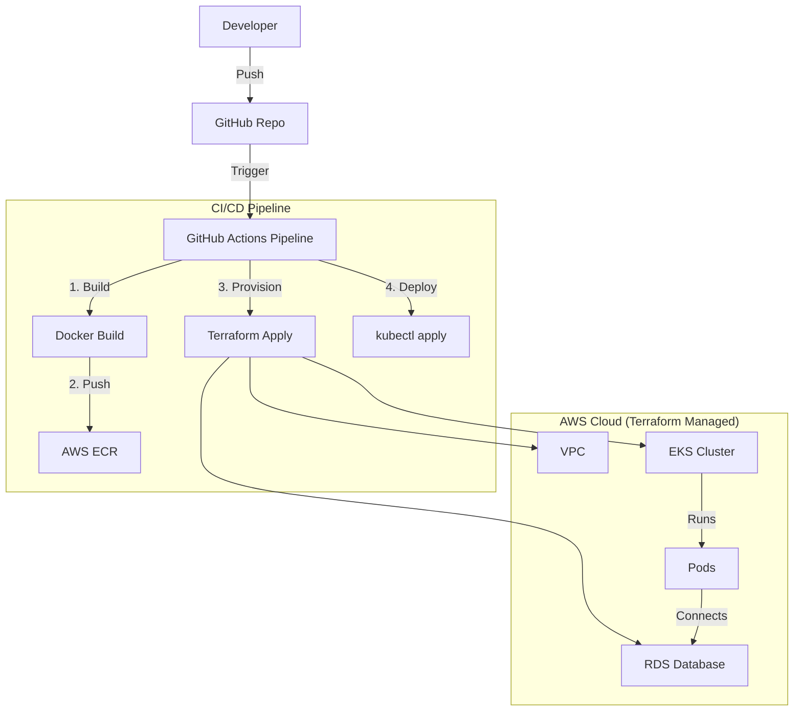

# DevOps Report - Lab Final Exam

## Technologies Used
- **Containerization**: Docker, Docker Compose
- **Orchestration**: Kubernetes (AWS EKS)
- **Infrastructure as Code**: Terraform (AWS Provider, Helm Provider)
- **CI/CD**: GitHub Actions
- **Monitoring**: Prometheus, Grafana (via Helm chart)
- **Database**: AWS RDS (PostgreSQL)
- **Configuration Management**: Ansible (for K8s configuration)

## Pipeline & Infrastructure Diagram

## Secret Management Strategy
Secrets (Database credentials, AWS keys) are managed using **GitHub Actions Secrets**.
- `AWS_ACCESS_KEY_ID` and `AWS_SECRET_ACCESS_KEY` are stored in GitHub Secrets and injected into the pipeline runner.
- Application secrets (Database URL) are injected into Kubernetes as `Secret` objects during deployment or managed via ExternalSecrets (simulated here with `secrets.yaml` and pipeline injection).
- No secrets are hardcoded in the codebase source files.

## Monitoring Strategy
We utilize **Prometheus** for metrics collection and **Grafana** for visualization.
- The `kube-prometheus-stack` Helm chart is deployed via Terraform.
- Prometheus scrapes metrics from Kubernetes nodes and pods.
- Grafana provides dashboards for Cluster resources (CPU/Memory) and Application performance.

## Lessons Learned
- **Infrastructure as Code**: Managing state complexities with Terraform requires careful planning, especially with EKS dependencies.
- **Bootstrapping EKS**: Initializing EKS takes time; pipelines must handle timeouts or long-running steps gracefully.
- **Cost Management**: Using `t3.small` and single-AZ RDS helps keep lab costs down, but production requires redundancy.
